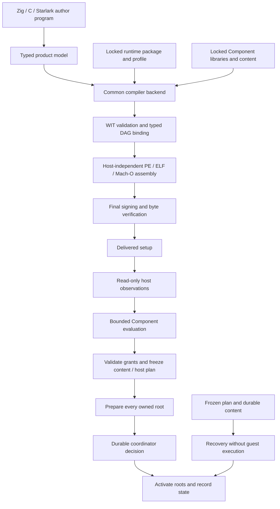

# Architecture overview

Niobium compiles installation and distribution programs into a setup containing a
complete precompiled native runtime, a typed product graph, fixed Wasm Components
and content containers. [ADR-0022](../adr/0022-installer-dsl-and-aot-toolchain.md)
defines the DSL/AOT direction;
[ADR-0023](../adr/0023-standard-content-and-component-contracts.md) defines the
standard content, Component and cross-host baseline. Qualification belongs to
[N2 acceptance](../acceptance-plan-v0.2.md), with separate records for each profile.

## Compilation and execution

Author programs execute on the build host. The Zig API and authoring C ABI own
copied typed inputs; Starlark calls that public C ABI. The emitted JSON is compiler
IR. Source-location sidecars are separate from normalized semantic identity.
The compiler validates dependency identities, target/profile compatibility,
Component signatures, typed projections, call order and scoped grants. A library
cannot introduce another runtime dependency during installation.

Assembly copies a complete target template and appends the compiled program and
canonical payload, updating a small reserved descriptor. It preserves executable
code sections. Neither the target runtime nor a runtime compiler/linker runs in
this stage. Runtime publishers build target templates separately. Signing follows
assembly; verification and target execution refer to those exact final bytes.

## Implementation owners

| Owner | Implemented responsibility |
|---|---|
| `program` | Versioned product graph, lossless WIT values, reflected type contracts, runtime profiles and bounded worker envelope |
| `compiler` | Shared author construction, locks, profile binding, type checking, cache, diagnostics, cancellation and atomic assembly/publication |
| `content` | Bounded logical trees, transforms, conflict checks and canonical POSIX pax serialization |
| `image` | Streaming PE/ELF/Mach-O inspection and assembly, identity checks and supported Mach-O ad-hoc measurements |
| `component_worker` | Upstream Component C API type inspection, value conversion and one disposable evaluation session |
| `component_client` | Fixed executable invocation, bounded IPC, deadline and cancellation |
| `host_primitives` | Versioned machine observations and the published primitive profile |
| `evaluator` | Typed DAG bindings, explicit converters and normalization of generated trees into host-owned references |
| `access_policy`, `access` | Portable access intent, native application/verification and durable receipts |
| `kernel` | Ownership, compatibility selection, frozen plans, generation preparation, coordinator decision and recovery |
| `stdlib/files` | Optional deployment and content selection through the public library contract |
| `apps/compiler-v2`, `apps/runtime-v2` | Process assembly and CLI adapters |
| `apps/libcompiler/v2.zig`, `apps/starlark/v2` | Public C and hosted author frontends |

The runtime graph excludes compiler, author frontend and preset modules. The
Component engine uses pinned Wasmtime with Pulley and no ambient WASI or native
JIT. Standard upstream tooling generates guest bindings and implements the
Canonical ABI. Type-only imports carry no callable authority; production product
calls consume prebound values and return declarative plans.

## Content, effects and recovery

A container describes files, directories and explicit confined symbolic links.
Source archive identity, canonical logical identity, generated derivation and
deployed resource identity remain separate. The host parses fixed archives as
bounded file views and persists generated content before freezing a transaction.
Source tar modes are metadata; concrete access policies determine machine rights.
The current proposal applies one file policy and one directory policy per tree.
Products can partition content by required policy; finer per-entry policy is
separate work.

Observations report facts. Libraries decide the product response, optional
selection, layout and migration behavior. The kernel verifies resource ownership,
grant ceilings and every frozen reference. A successful generated-tree proposal
becomes a host-computed reference before a dependent call consumes its result.

Each root stages a complete generation. A coordinator records one commit decision
before activation begins. Recovery before that decision retains OLD; recovery
afterward completes NEW on every root. Cross-root visibility during activation is
not simultaneous. Recovery never resolves a library, reruns a converter or
reevaluates an author program. Modified and unrecorded user data is retained.
The [lifecycle contract](../spec/runtime-lifecycle-v2.md) owns these rules.

## Retained implementations

The Core Wasm/WAMR v1 compiler and runtime remain under `apps/compiler`,
`apps/runtime`, `wasm_profile`, `wasm_host` and `runtime`; their `aot-*` evidence
retains its original macOS and 1 MiB scope. The earlier manifest/engine path uses
`apps/setup`, `apps/nbpack`, `apps/libdistribution` and `libs/engine`. Its trust,
platform and UI regressions remain gates for reused code.

The shared UI renderer and pure UI modules are unchanged. New UI adapters must
use typed runtime inputs, state and progress. The
[module disposition](module-boundaries.md) and [roadmap](../roadmap-v0.3.md) identify
owners and remaining integration work without extending old evidence to new APIs.
